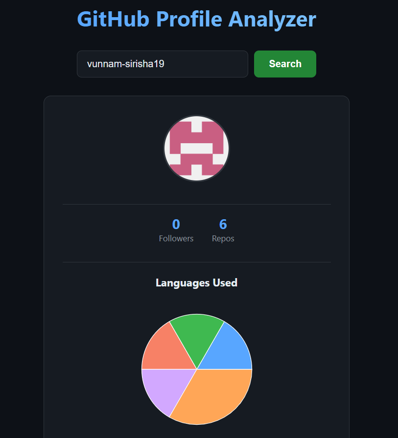
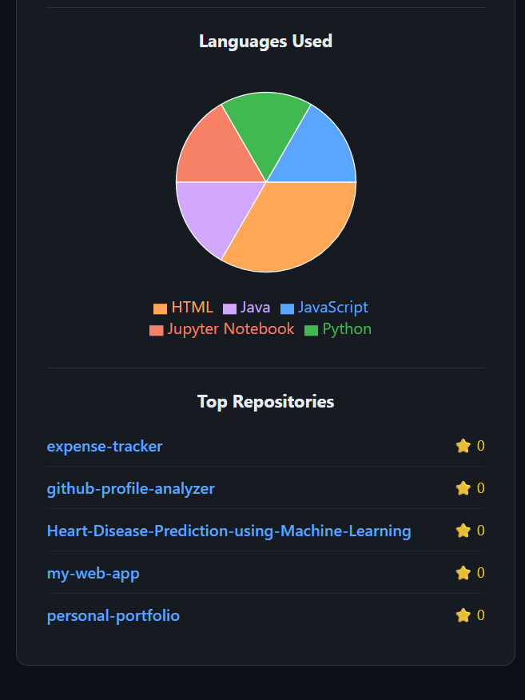

# GitHub Profile Analyzer

A full-stack web application that analyzes any public GitHub profile — fetching real-time data via the GitHub API and visualizing language usage and top repositories in a clean, dark-themed dashboard.


📁 **GitHub:** https://github.com/vunnam-sirisha19/github-profile-analyzer

---

## Screenshots
 
### Search Page



---

## Features

- 🔍 **Search any GitHub username** — fetches real-time public profile data
- 📊 **Language breakdown** — interactive pie chart showing languages used across all repos
- ⭐ **Top repositories** — top 5 most-starred repos with direct links to GitHub
- 👥 **Profile stats** — followers count and public repo count at a glance
- 🎨 **Dark-themed UI** — clean card-based layout with colored chart segments

---

## Tech Stack

**Backend**
- Django 5.x
- Django REST Framework
- Requests (GitHub REST API integration)
- django-cors-headers

**Frontend**
- React 18
- Axios (API calls)
- Recharts (pie chart visualization)

---

## Project Structure

```
github-analyzer/
├── backend/
│   ├── analyzer/        # GitHub API integration, views, URLs
│   └── backend/         # Django settings, URLs
├── frontend/
│   └── src/
│       ├── App.js       # Main component: search, state, rendering
│       └── App.css      # Dark theme styling
└── .gitignore
```

---

## How It Works

1. User enters a GitHub username in the search bar
2. React sends a GET request to the Django backend
3. Django calls the GitHub REST API to fetch the user's profile and repository data
4. The backend processes this data — counting languages across repos, ranking repos by stars — and returns clean JSON
5. React renders the data as a profile card, pie chart, and repo list

---

## Running Locally

### Prerequisites
- Python 3.11+
- Node.js 18+

### Backend Setup
```bash
cd github-analyzer
python -m venv venv
venv\Scripts\activate       # Windows
pip install django djangorestframework requests django-cors-headers
cd backend
python manage.py migrate
python manage.py runserver
```

### Frontend Setup
```bash
cd frontend
npm install
npm start
```

Visit `http://localhost:3000`, type any GitHub username (e.g., `torvalds`, `octocat`), and click Search.

---

## API Endpoints

| Method | Endpoint | Description |
|--------|----------|-------------|
| GET | `/api/profile/<username>/` | Fetch GitHub profile, language breakdown, and top repos |

---

## What I Learned

- Integrating with a third-party REST API (GitHub) from a Django backend
- Passing and transforming external API data before sending it to the frontend
- Building and connecting a full-stack application with separate frontend/backend servers
- Data visualization using Recharts in React (pie charts, legends, tooltips)
- Handling CORS issues between a Django backend and React frontend
- Git/GitHub workflow: staging, committing, and pushing a multi-folder project

---

## Future Improvements

- Add GitHub token support to avoid API rate limiting
- Show commit activity over time as a line chart
- Compare two GitHub profiles side by side
- Add a loading skeleton instead of plain "Loading..." text
- Deploy backend on Render, frontend on Vercel
